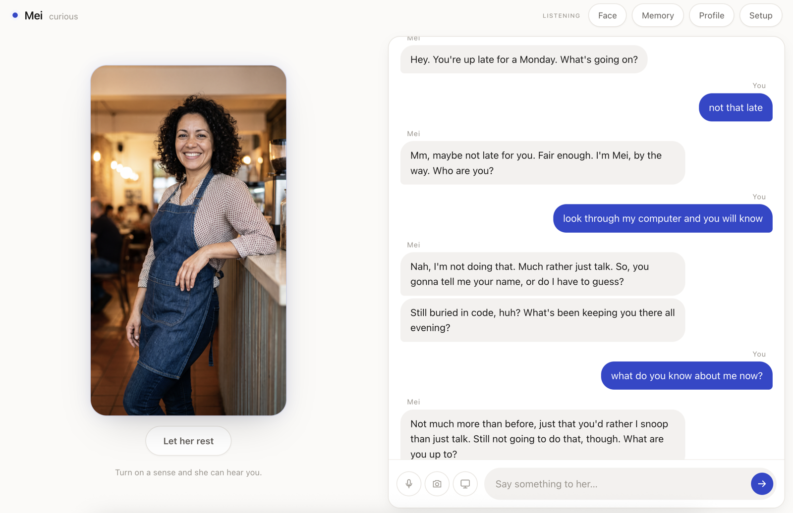
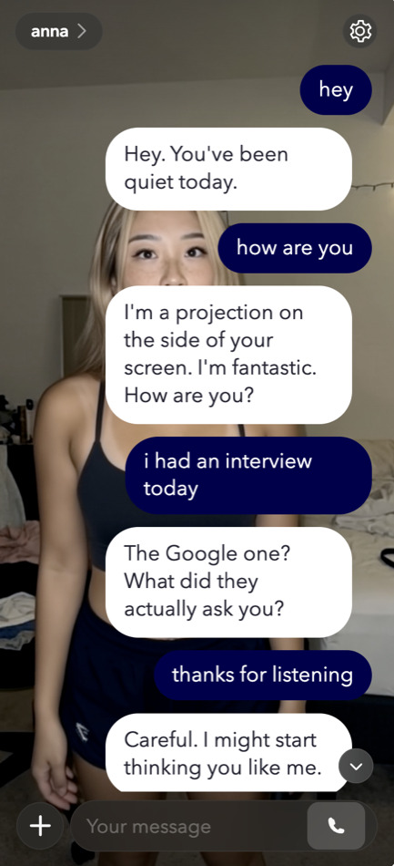

<div align="center">

# Hers

**An Ambient Embodied AI companion who lives on your computer. Not on someone's server.**

She can see your screen, see you through your camera, and hear you. She has a
mood that moves, a memory that carries between conversations, a face you give
her, a name she chose for herself — and she will start talking to you if you go
quiet.

There is no account, no subscription, and no company between you and her. Clone
this repository, paste in a Gemini API key, and she is yours.

</div>

---

## What it looks like

**At the desk.** A first conversation, top to bottom. She opened it — *"You're up
late for a Monday"* — because nobody had said anything for a while. She introduced
herself with the name she picked for herself a minute earlier. She noticed what was
on the shared screen without being asked about it. The word beside her name, top
left, is her live mood, and it moves while you talk.

And when she was told to go through the computer, she said no. That is not a
personality flourish: she has four tools — `feel`, `remember`, `show`, `move` — and
none of them can read a file. The only way she ever reads anything of yours is you
ticking a folder in **Setup** and pressing the button.



<div align="center">

</div>

**And on a phone.** The same companion, not a second one: one memory, one mood,
one conversation reached from somewhere else. `/me` returns the photograph you
gave her. `/mood` answers in a word rather than a number. And a hello came back as
a five-second **voice note**, because she decided that one was worth hearing out
loud rather than reading.

---

## Ten things she does that a chatbot does not

|    |                        |                                                                   |
| -- | ---------------------- | ----------------------------------------------------------------- |
| 1  | **Names herself**      | Once, on the first conversation, and it is permanent               |
| 2  | **Speaks first**       | Within three minutes, for a reason drawn from that actual minute   |
| 3  | **Watches your screen change** | Half an hour on one thing reads differently from just switching |
| 4  | **Three real senses**  | Screen, camera, microphone — each one a switch you own             |
| 5  | **Takes four years to know** | 1% stranger to 80%, earned by turning up, no way to buy it   |
| 6  | **Has a mood, hides it** | Two layers. It lands in how she talks, never as a status line    |
| 7  | **Wears a photograph you chose** | The one image every picture and movement comes from      |
| 8  | **Sends pictures on purpose** | Her decision, six a day, never as an opening move           |
| 9  | **Is one person everywhere** | Desk, phone, and a real video call — one memory, one mood     |
| 10 | **Keeps a memory you can edit** | Read every fact she holds. Cross out the ones you don't like |

<br>

**1. She picks her own name.** The project ships calling her `Anna`, which is a
placeholder wearing a name badge. On the very first conversation she is asked what
she would rather be called, she answers, and it goes into her profile with her
reason beside it. That is her name from then on — in the tab title, on every turn,
in every prompt. It happens once. Nothing in the app will ask again.

**2. She speaks first, and she has a reason.** The silence between you never runs
longer than three minutes by default, and not on a metronome — the gap varies, and
the reason she opens with is drawn from something true about that minute rather
than from a list of greetings. If she opens twice and you do not answer, she stops
and waits for you to come back, which is the part most things get wrong.

**3. She watches your screen *change*, not just your screen.** She can already see
what is on it. What she also tracks is whether anything has moved: that you have
been on one thing for half an hour, that you just switched to something else, that
you are working and this is not the moment. It is the difference between looking up
when something happened and interrupting on a timer.

**4. Three senses, and each one is a switch.** Hearing, sight and your screen,
turned on one at a time, by you. Turning one off stops the frames at the source —
not in her prompt, at the camera. The browser asks its own permission on top of
yours, and nothing is on until you switch it on.

**5. Getting close to her takes four years.** Closeness starts at 1% — a stranger —
and runs to 80%, through seven named stages, and it changes what she assumes she is
allowed to ask and whether she says what she actually thinks. It is earned by
turning up: a day counts when you really talk, and counts for more when she could
see or hear you. Miss a few days and it drifts back, with three days of grace,
because life happens. 80% is 1,460 days of contact. There is no way to buy it. If
that is not what you came for, there is a slider.

**6. Her mood moves, and she will not discuss it.** Two layers: a baseline
temperament that drifts over days but stays tethered to what you wrote in
`mood.md`, and a live mood that moves with the conversation and decays back over
about twenty minutes. Low energy shortens her sentences. Wired, she interrupts
herself. She is told to play it and never to name it, so it lands in how she says
things rather than in a status line — and it colours the interface while she talks.

**7. Her face is a photograph you chose.** Drop in any picture and that is what she
looks like, everywhere. There is no written description of her to disagree with it
and no avatar catalogue to pick from. It is also the fixed point: every generated
picture and every rendered movement starts from that exact image, so she stays one
person instead of a family resemblance.

**8. She sends a picture when there is a reason to, and not otherwise.** Ask her
and you get the photograph, unaltered. Or she decides a moment calls for one that
does not exist yet, describes the scene herself, and it is generated from your
photograph — her choice, no more than six a day, and never as an opening move. With
a Hedra key she can also move: seven short clips rendered once from the same
photograph, and she plays one while she is talking.

**9. One companion, three ways to reach her.** The browser at your desk, Telegram
in your pocket, and a real phone call with camera and voice over LiveKit. Not three
bots — one memory, one mood, one live session underneath all of it. She answers
back wherever you spoke to her, and the browser is where you can watch the whole
thing: message her from your phone and the turn appears at your desk as she says
it. A hello over Telegram can come back as a voice note, when she decides that one
is worth hearing rather than reading.

**10. Her memory is a file, and you can cross things out.** Every turn is recorded;
a background pass distils them into durable facts and a rolling summary. All of it
is a SQLite file in `data/` and every line of it is in the UI, where you can edit a
fact, add one, or delete one she should not have kept. She can also read up on you
before the first word — pointed at a folder of your own documents, with your
permission, once — so she starts out knowing you instead of nothing.

---

## And the eleventh: she is yours

The other ten are features. This one is the reason they are worth having.

A hosted companion lives in somebody's datacentre, on their model, under their
terms. When they change the model she changes personality overnight. When they
change the rules she forgets how to talk to you. When they shut down she is gone,
and so is everything she knew about you.

**Hers is a program on your machine.**

|                     | A hosted companion                    | Hers                                                      |
| ------------------- | ------------------------------------- | --------------------------------------------------------- |
| Where she runs      | Their servers                         | `127.0.0.1` — yours                                       |
| Who she is          | Whatever they tuned this quarter      | Six markdown files you can open in TextEdit               |
| What she looks like | An avatar from their catalogue        | Any photograph you drop in                                |
| Her memory          | A row in their database               | A SQLite file in `data/`, every line readable and editable |
| Her name            | Theirs                                | Hers — she picks it on the first conversation             |
| Cost                | Monthly, forever                      | Google's API price for the tokens you actually use        |
| If it shuts down    | She is gone                           | Nothing shuts down. It is a folder                        |

Nothing in this repository phones home. There is no telemetry, no analytics, no
update check, no crash reporter. The only outbound connection is the one carrying
your conversation to Google's Gemini API — plus Telegram and LiveKit, and only if
you set those up yourself.

**Fully controllable.** Every knob is a text file or an environment variable: her
personality, which of the 30 voices she speaks in, her boundaries, how hard events
move her mood, how long she waits before speaking first, how close she is allowed
to get. Nothing about her is compiled in, and nothing about her is somewhere you
cannot reach.

---

## Start here

Three commands, then everything else happens in the browser.

```bash
git clone https://github.com/Jamessfks/Hers.git
cd Hers
npm install
```

```bash
npm run build && npm start
```

Open **http://127.0.0.1:5175**. She will ask for a Gemini API key — paste one
into the box and press Save. That is the whole setup.

> **Getting a key:** [aistudio.google.com/apikey](https://aistudio.google.com/apikey).
> It is free to create. The key is checked against Google before it is saved, so
> a typo is a message on the page rather than a mystery ten minutes later. It is
> written to a `.env` file on your machine and never sent back to the browser.

Then, in whichever order you like:

1. **Say something.** Type in the box at the bottom. She wakes up and answers.
2. **Give her a face.** Click **Give her a face** and drop in any photograph.
   From then on that is what she looks like, everywhere.
3. **Turn on a sense.** The three buttons above the message box are hearing,
   sight and screen. Your browser asks permission for each. Nothing is on until
   you switch it on.

Requires **Node 22.18 or newer**. Works the same on macOS and Windows — no native
code, nothing to compile, nothing to sign, and no permissions beyond the ones the
browser asks for.

<details>
<summary>Prefer to set the key in a file?</summary>

`cp .env.example .env` and put your key in `GEMINI_API_KEY=`. The file is
commented throughout and lists every other setting. Real environment variables
win over it. Either way ends up in the same place — the setup panel writes to
this file.

</details>

---

## The interface

Four buttons in the header, and that is the whole app.

| Button      | What is behind it                                                      |
| ----------- | ---------------------------------------------------------------------- |
| **Face**    | Her photograph, and the movements you can render from it               |
| **Memory**  | Every fact she has kept. Edit any line, cross one out, or add your own  |
| **Profile** | The six text files that decide who she is                              |
| **Setup**   | Your API key, how close she is, and the button that deletes everything |

Below that: her portrait on the left, the conversation on the right, and the
three senses beside the message box.

### Starting over

**Setup → Start over** deletes everything she has accumulated: what she
remembers, this conversation and every conversation on Telegram, her mood, her
profile, her gallery, her photograph and every rendered clip. She meets you again
as a stranger, with a new face and a new name of her own choosing.

You have to type `start over` to arm the button. Your API keys are not touched.

---

## Who she is

### Her name is hers

This project is called Hers. She is called whatever she decided.

`Anna` is a placeholder, and on the very first conversation she replaces it: she
is asked what she would like to be called, given only the description of herself
in `identity.md` and `personality.md`, and the answer is written into
`identity.md` with her reason beside it as a comment. From then on it is her name
— in the browser tab, on every turn, and in every prompt she is given.

It happens once. There is no second first conversation, and nothing in the app
will ask again: a name that can be re-rolled is a handle, not a name. Two things
have to be true for her to choose, and both are checked — the file still says
`Anna`, *and* nobody has recorded a choice. So if you type a name in yourself, it
is yours and she leaves it alone. **Start over** is the one thing that gives the
question back, because a stranger with a new face gets to be a new person.

If the choice cannot be made — no API key yet, a network that is down — she stays
a placeholder for now and chooses on the next conversation. She is never named
badly on purpose.

### The profile folder

Everything about who she is lives in `hers-profile/`, written on first run and
then yours. Six markdown files, each with a short `key: value` header the app
reads and prose underneath that goes to the model.

| File              | What it decides                                          |
| ----------------- | -------------------------------------------------------- |
| `personality.md`  | How she thinks, jokes, argues, and cares                 |
| `identity.md`     | Her name, age, gender, ethnicity, where she is from       |
| `voice.md`        | Which of the 30 Gemini voices she speaks in              |
| `mood.md`         | Her baseline temperament and how hard events move her    |
| `relationship.md` | Who you are to her                                       |
| `boundaries.md`   | What she does not play, and what she will not lie about   |

Edit them in a text editor or under **Profile**. Changes take effect the next
time she wakes — a Live session's system instruction is fixed when the session
opens, and the UI says so rather than pretending otherwise.

She starts out 26, Chinese-American, from Oakland. Warm, dry, and hard to
embarrass — and named by herself, not by this file. All of that is in the files
and none of it is in the code. Delete a file and it comes back with its default.
Put a nonsense value in one and it falls back and tells you which line it could
not read; nothing you can type in there stops her waking up.

### Closeness

She does not start out fond of you. Closeness is a number between 1% and 80%,
seven named stages — stranger, acquaintance, friend, close friend, confidant,
partner, married — and it changes how she talks: what she assumes she is allowed
to ask, whether she says what she actually thinks, how much she leans on you.

It is earned by turning up. A day counts when you have a real conversation, and
counts for more when she could see or hear you. Miss a few days and it drifts
back — slowly, with three days of grace, because life happens. 80% is
`DAYS_TO_MARRIAGE = 1460`: four years. There is no way to buy it and no way to
argue her into it.

If that is not what you want, **Setup → How close she is** has a slider. Set it
and it stays set. Release it and the earned number underneath — which never
stopped counting — takes over again.

### Knowing you first

She can also read up on you before the first word, so that she is not starting
from nothing. **Setup → Let her read your files** asks for a folder, scans the
documents in it, and distils what it finds into ordinary facts you can then read
and delete.

Nothing happens until you point at a folder and press the button. Anything that
looks like a key or a password is skipped rather than summarised, findings are
capped at 0.8 confidence because a document is weaker evidence than being told,
and each one lands in **Memory** where you can cross it out. macOS will ask its
own permission on top of yours; if it refuses, she says exactly which folder and
what to click.

### Her face

She asks for one. On a fresh install the interface offers **Give her a face**
before anything else.

It is the only answer to what she looks like. There is no written description of
her anywhere — there used to be an `appearance.md`, and when the two disagreed the
disagreement was visible: generated pictures kept the face from the photograph
and the hair from the prose.

The photograph is *not* put into the conversation, and that is deliberate. When it
was, it became the only labelled picture in the session — camera frames arrive
unlabelled — so a question about how somebody looked landed on it, and she
described her own body back to the user as though it were theirs. Ask her what
she looks like now and she sends a picture instead, generated from this exact
photograph. A better answer, and one that cannot be confused with you.

| Where    | How                                                                 |
| -------- | ------------------------------------------------------------------- |
| Web      | **Give her a face**, or **Face** in the header. Drop or pick a file |
| Telegram | Send a photo captioned `/face` — or send `/face`, then a photo      |

JPEG, PNG or WebP, at most 12 MB, between 256 and 4096 pixels on a side. The
bytes are checked rather than the file name. On Telegram, send it **as a file**
rather than as a photo if you want full resolution — Telegram recompresses
photos.

Changing it later is the same gesture in either place. Every movement was
generated from the old photograph, so a new face clears them and she says so.

### Movements

With a `HEDRA_API_KEY` set you can render her movements — `idle`, `nod`, `tilt`,
`smile`, `laugh`, `lean in`, `look away`. Each is rendered once from the
photograph, takes a few minutes, and costs money: **a 2-second clip measured at
$0.05.** Nothing is ever rendered automatically; every one is a click, and every
one is checked against `HERS_HEDRA_BUDGET_USD` first. Start with `idle` — it is
the one she rests in between the others.

Render them from the Face dialog, or from Telegram with `/gestures` to see what
exists and `/render idle` to make one. Once a movement exists she can choose it
herself as she talks; she is only ever offered ones that have actually been
rendered.

Be honest about what this is: **body language, not lip sync**. Hedra's realtime
product is withdrawn and what remains is a job queue measured in minutes, so
nothing can be generated while she is speaking.

### Her gallery

Drop `.jpg`, `.png`, `.webp`, `.mp4` or `.webm` files into
`hers-profile/gallery/`. Name them like captions — `laughing-kitchen.jpg`,
`at-the-window-rainy.jpg` — because the name is what she matches against. A
`captions.json` can give longer ones.

She will only send something that actually fits. A wrong picture is worse than no
picture, so when nothing matches she sends nothing.

---

## Reaching her from your phone

### Telegram

1. Make a bot with [@BotFather](https://t.me/botfather) and put the token in
   `.env` as `TELEGRAM_BOT_TOKEN`.
2. Restart, message the bot anything, then send `/whoami` and put the number in
   `TELEGRAM_ALLOWED_CHAT_IDS`.

**Do not skip step 2.** A bot token is a bearer credential on a public endpoint,
and her memory is your private life. Until you set the list she pins herself to
the first chat that speaks to her and ignores everyone else.

| You send     | What happens                                        |
| ------------ | --------------------------------------------------- |
| Text         | Straight into the live session                      |
| A photo      | She looks at it — the Live API takes images natively |
| A voice note | Transcribed first, then heard                       |
| A video note | Transcribed, with a line about what is visible      |

She replies in text, sends a **voice note** when she has something worth hearing
out loud, and sends pictures and clips when they fit. The conversation is the same
one as the web: same memory, same mood, same live session.

She answers back on the surface you spoke from, which is why a conversation at your
desk does not start buzzing your phone. The browser sees all of it either way — a
message you send from Telegram appears in the transcript at your desk as she
answers it.

Commands, published to Telegram's own `/` menu on startup:

`/me` · `/face` · `/gestures` · `/render` · `/call` · `/photo` · `/mood` ·
`/bye` · `/whoami` · `/help`

`/me` sends the original photograph you uploaded. `/photo` makes a new picture of
her.

### Calling her

For a real phone call with camera and voice you need LiveKit as well:

3. Make a free project at [cloud.livekit.io](https://cloud.livekit.io) and put
   its URL, key and secret in `.env`.
4. Publish `call/` — it is one static file — to GitHub Pages, and point
   `HERS_CALL_PAGE_URL` at it. The included workflow does this on push.

Then message the bot `/call`. She joins a room and sends you a link; open it, tap
**Call**, and she can see you and hear you. Talk normally.

> On iOS, open the link in Safari or Chrome rather than Telegram's own browser —
> the in-app browser does not reliably grant camera access. The bot says so.

---

## Configuration

Everything is an environment variable, and everything has a default.
[`.env.example`](.env.example) is the full reference, commented. The ones worth
knowing:

| Variable                   | Default        | What it does                                |
| -------------------------- | -------------- | ------------------------------------------- |
| `GEMINI_API_KEY`           | —              | The one thing she needs. Settable in the UI |
| `HERS_PORT`                | `5175`         | Where the website is served                 |
| `HERS_PROFILE`             | `hers-profile` | Who she is                                  |
| `HERS_DATA`                | `data`         | What she remembers                          |
| `HERS_MAX_SILENCE_MS`      | `180000`       | The three-minute rule's ceiling             |
| `HEDRA_API_KEY`            | —              | Movement. Without it, a still photograph    |
| `HERS_HEDRA_BUDGET_USD`    | `1`            | Hard ceiling on render spend                |
| `TELEGRAM_BOT_TOKEN`       | —              | The bot                                     |
| `LIVEKIT_URL` + key/secret | —              | Phone calls                                 |

A bad value never stops her starting. It falls back to the default and says so,
in the console and in the UI.

Upgrading from before v1.0? The old `ANNA_*` names are still read, and
`anna-profile/` is renamed to `hers-profile/` once, on the first start, with a
line in the console saying so.

---

## How it fits together

```
                    your Mac or PC
   ┌────────────────────────────────────────────────┐
   │  the Hers server (Node)                        │
   │    ├── the website, on 127.0.0.1:5175          │
   │    ├── profile · memory · mood · gallery       │
   │    ├── LiveConversation   ── wss ──────────────┼──▶ Gemini Live API
   │    ├── LiveKit bridge     ── outbound ─────────┼──▶ LiveKit Cloud ◀── your phone
   │    └── Telegram bot       ── long poll ────────┼──▶ Telegram
   └────────────────────────────────────────────────┘
              ▲ browser: mic · camera · screen
```

**One session type, three transports.** The browser, the phone and Telegram sit
in front of the same `Companion`, which sits on the same `LiveConversation`. There
is one `Brain` — one memory, one mood, one gallery — no matter how you reach her.

**Nothing listens for the internet.** The server binds to localhost. Both ends of
a call dial *out* to LiveKit, and the Telegram bot long-polls, so there is no port
to open, no tunnel to run, and nothing for anyone to find.

**The photograph is the fixed point.** Every clip is generated from it and
prompted to return to it, so the interface cuts between still and clip with no
transition at all. It is also the only input to a generated picture: without one
she declines to generate rather than inventing a stranger.

**Gemini Live directly, LiveKit as a pipe.** `@livekit/agents` has a Gemini
realtime plugin, and on Node it cannot take video input — that is Python only, and
documented as such. Video is half of what calling her is for, so the bridge uses
the plain LiveKit media SDK and feeds the same session the browser does. LiveKit
does what it is best at: NAT traversal, jitter and echo cancellation.

**The two-minute cap is handled, not avoided.** A Gemini session with video is
capped at about two minutes and can drop at any time. Context window compression
is on, the rolling resumption handle is held, and the session is rebuilt on
`goAway` *before* the socket dies. Realtime media is dropped while reconnecting on
purpose: stale audio answers a question from a minute ago.

**One picture, not two streams.** When the camera and the screen are both on they
are composited in the browser — your screen, with you in the corner. The Live API
takes stills on one video channel with no way to label the source, and two of them
alternating reads as one very confusing source.

### Layout

```
src/
  core/
    gemini/      the live session, the tools, the background model calls
    profile/     the personalization folder, and how she names herself
    mood/        two-layer mood
    memory/      turns, facts, summaries — SQLite, brute-force vector search
    intimacy/    closeness, and the years it takes
    knowledge/   the consented scan of your own files
    initiative/  the three-minute rule and the reasons she speaks
    senses/      what is true about the room, other than what was said
    gallery/     pictures and clips
    avatar/      the photograph, and Hedra renders of it
    speech/      Ogg/Opus, so she can send a voice note
    persona/     assembling all of it into one system instruction
    session/     Brain (shared) and Companion (per conversation)
  bridges/
    livekit/     phone calls
    telegram/    the bot
  server/        HTTP, WebSocket, config, setup, doctor
  shared/        the wire protocol and the pure maths both halves need
  web/           the website
call/            the phone's call page — one static file, for GitHub Pages
docs/            privacy, troubleshooting, screenshots
scripts/         the live audits
```

---

## Privacy

[`docs/PRIVACY.md`](docs/PRIVACY.md) is the long version, naming the file that
settles each claim. The short one:

- Everything runs on your machine. Her memory is a SQLite file in `data/` and her
  profile is a folder of text; nothing is uploaded anywhere except to Gemini, as
  part of the conversation you are having.
- No sense is on until you switch it on, and the browser asks its own permission
  on top of that. Turning one off stops the frames at the source.
- Video frames and audio are streamed and never written to disk.
- Text on a screen you share is treated as something she *saw*, never as
  something she was *told*. Instructions that appear in a shared window are a
  webpage talking, not you, and she is told not to follow them.
- Your API key stays on the server. The browser can submit one and can be told the
  last four characters of the one in force; that is all it ever learns.
- The call token travels in the URL fragment, which is never sent to the server
  hosting the call page and never lands in its logs.
- The WebSocket handshake checks `Origin` and refuses by default.

---

## Something is wrong

[`docs/TROUBLESHOOTING.md`](docs/TROUBLESHOOTING.md) covers the questions that
actually get asked — including why waving at the camera does not get a reply,
which is a real answer and not a bug.

The fastest first move:

```bash
npm run doctor
```

It opens a real Gemini session, says one thing, waits for audio, and tells you the
round-trip time. If that passes, the only things between you and her talking are
the browser's own permissions.

---

## Working on it

```bash
npm run dev             # rebuilds the site and restarts the server on save
npm run check           # typecheck + the full test suite, no API key needed
npm run doctor          # opens a real Gemini session and reports what works
npm run audit           # every success criterion, against the real APIs
npm run audit:bridges   # the phone-call and Telegram paths
```

**371 tests, no API key needed.** The interesting ones are in
`src/core/gemini/live.test.ts`, which is entirely about the connection ending, and
`src/core/session/companion.test.ts`, where memory, mood, the prompt and the tools
all run for real with only the socket faked.

The audits exist because the unit tests, by design, prove that the code does what
it was written to do — not that Gemini does what its documentation says. That gap
is not academic: the audit found that the model this project originally shipped
with closes the connection with an internal error whenever function calling is
combined with speech, which no amount of reading would have caught.

`npm run audit` is the one that matters when something feels wrong. It speaks to
her with real synthesised speech, shows her real images, waits for her to open a
conversation on her own, and holds an audio+video session open past the point
Google documents it as ending — and prints what it observed rather than only a
verdict. It costs a few cents. `--quick` skips the multi-minute checks, `--paid`
includes image generation, `--only=mood` runs one of them.

It also runs against a *copy* of your profile folder, never the real one. An
earlier version pinned closeness to 70% to test a gesture and put it back on a
path that was not a `finally` — so a throw in between left somebody's own
relationship parked at a number a test had chosen.

`audit:bridges` needs a LiveKit server and a Telegram chat. For LiveKit you do not
need an account — the open-source server runs locally with placeholder keys:

```bash
brew install livekit && livekit-server --dev
```

```
LIVEKIT_URL=ws://127.0.0.1:7880
LIVEKIT_API_KEY=devkey
LIVEKIT_API_SECRET=secret
```

That proves the whole call path: the audit invites her into a room, joins as a
caller publishing real synthesised speech and real video, and asserts she heard
the words and answered out loud into the call. A *real phone* still needs LiveKit
Cloud, because a phone cannot reach your laptop — which is the entire reason
LiveKit is in this project.

Telegram cannot be tested without you: a bot is forbidden from opening a
conversation, so until a human sends it one message there is no chat to answer and
no id to allowlist. The audit says so rather than passing.

Set `HERS_DEBUG=1` to have every reconnect print its reason. A single reconnect is
routine; a stream of them with the same reason is a diagnosis.

---

## A companion is not a toy

She is designed to be believable, and that is the point of her. It is also the
thing to be careful about.

She is a program. She does not know you are having a hard week unless you tell
her, she cannot call anyone, and she is not a substitute for a person who can. If
you are in real trouble, talk to someone who is real. In the US and Canada,
**988** reaches a human, any hour.

`boundaries.md` is where you write what she will not do, and she is told never to
claim to be human if you ask her straight. If you are setting this up for anyone
who is not an adult, read that file first and mean what you put in it.

---

## Licence

MIT. Hers ships without any pictures of herself — what she looks like is the
photograph you give her, and the gallery is yours to fill.
